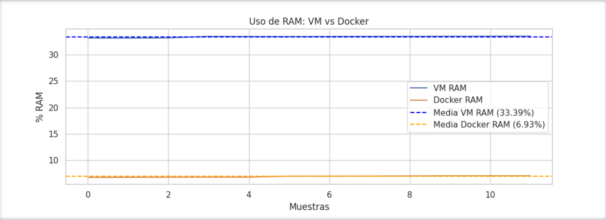
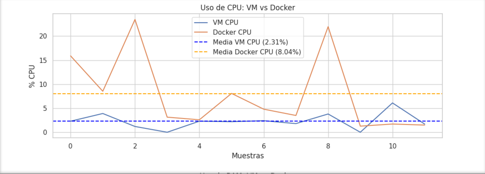
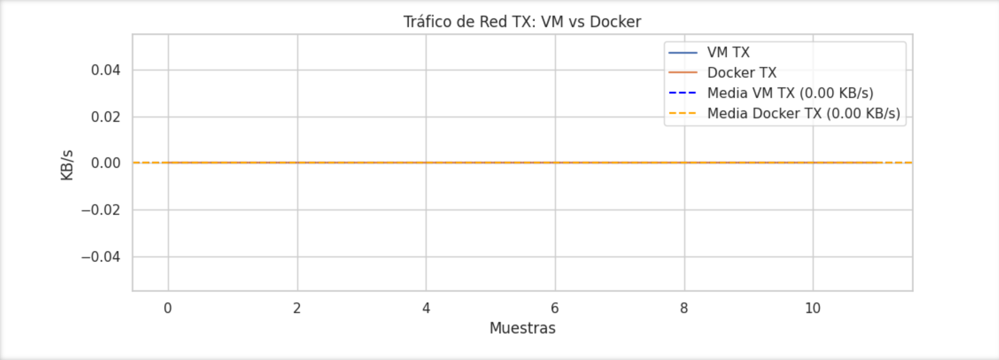

# 🎮 Rendimiento de Servidor Minecraft: VM vs Docker  
*Un análisis comparativo de recursos, latencia y eficiencia*  

---

## 📌 Tabla de Contenidos  
- [Introducción](#-introducción)  
- [Configuración del Entorno](#-configuración-del-entorno)  
- [Métricas Evaluadas](#-métricas-evaluadas)  
- [Resultados Detallados](#-resultados-detallados)  
- [Análisis Comparativo](#-análisis-comparativo)  
- [Conclusión y Recomendaciones](#-conclusión-y-recomendaciones)  
- [Repositorio y Recursos](#-repositorio-y-recursos)  
- [Bibliografía y Recursos](#-bibliografía-y-recursos)  

---

## 🌟 Introducción  
Este proyecto compara el rendimiento de un **servidor de Minecraft** implementado en dos entornos de virtualización:  
- **Máquina Virtual (VM)**: Utilizando VirtualBox con un SO completo.  
- **Contenedor Docker**: Basado en la imagen oficial `itzg/minecraft-server`.  

**Objetivo**: Determinar cuál tecnología ofrece mejor equilibrio entre consumo de recursos, velocidad y estabilidad para despliegues de servidores de juegos.  

---

## 🛠️ Configuración del Entorno  

### 🔩 Especificaciones del Host  
| **Componente**       | **Detalle**                                                                 |  
|-----------------------|-----------------------------------------------------------------------------|  
| **Portátil**          | MSI Katana 15 B13V                                                         |  
| **Procesador**        | Intel Core i7-13620H (13ª generación, 10 núcleos, hasta 4.9 GHz).           |  
| **Tarjeta Gráfica**   | NVIDIA GeForce RTX 4060 (8 GB GDDR6, DLSS 3).                              |  
| **RAM**               | 32 GB DDR5 (ampliable hasta 64 GB).                                        |  
| **Almacenamiento**    | 1 TB SSD NVMe PCIe 4.0.                                                    |  
| **Sistema Operativo** | Windows 11 Pro.                                                            |  

### 🖥️ Configuración de la VM  
- **Hipervisor**: VirtualBox 7.0.  
- **SO Invitado**: Ubuntu Server 22.04.  
- **Recursos Asignados**:  
  - 8 GB RAM.  
  - 4 núcleos de CPU.  
  - 50 GB de disco (SSD).  
- **Servidor Minecraft**: Descargado desde [minecraft.net/es-es/download/server](https://www.minecraft.net/es-es/download/server).  

### 🐳 Configuración de Docker  
- **Imagen**: `itzg/minecraft-server` (Java Edition).  
- **Límites**:  
  - 8 GB RAM.  
  - 4 núcleos de CPU.  
- **Puertos**: `25565/tcp` expuesto.  

---

## 📊 Métricas Evaluadas  
| **Categoría**         | **Herramientas/Métodos**                     |  
|-----------------------|---------------------------------------------|  
| **Uso de CPU/RAM**    | `htop`, `docker stats`, `VBoxManage metrics`|  
| **Latencia de Red**   | `iperf3`, mediciones manuales con `ping`    |  
| **Tiempo de Arranque**| Comandos `time` y `systemd-analyze`         |  
| **Tráfico de Red**    | `ifstat`, gráficos personalizados           |  

---

## 📈 Resultados Detallados  

### 1. Consumo de Recursos  
| **Métrica**       | **VM**            | **Docker**        |  
|--------------------|-------------------|-------------------|  
| **RAM Media**      | 33.39% (~10.68 GB)| 6.93% (~2.21 GB) |  
| **CPU Media**      | 2.31%             | 8.04%             |  
| **Espacio en Disco**| 50 GB            | 1.5 GB            |  

  
  

### 2. Rendimiento de Red  
| **Métrica**       | **VM**   | **Docker** |  
|--------------------|----------|------------|  
| **Latencia Media** | 0.14 ms  | 0.34 ms    |  
| **Tráfico TX/RX**  | 0.00 KB/s| 0.00 KB/s  |  

  
   

### 3. Tiempo de Arranque  
- **VM**: 30 segundos (hasta servicio activo).  
- **Docker**: 2 segundos.  

---

## 🔍 Análisis Comparativo  

### ✅ Ventajas por Tecnología  
| **VM**                          | **Docker**                      |  
|---------------------------------|---------------------------------|  
| - Menor uso de CPU (2.31%). <br> - Aislamiento completo de recursos. | - Arranque ultrarrápido (2 segundos). <br> - Menor consumo de RAM (6.93%). |  

### ❌ Limitaciones  
| **VM**                          | **Docker**                      |  
|---------------------------------|---------------------------------|  
| - Mayor consumo de RAM (33.39%). <br> - Tiempo de arranque lento. | - Mayor uso de CPU (8.04%). <br> - Ligera latencia de red (0.34 ms). |  

---

## 🎯 Conclusión y Recomendaciones  
- **Elige VM si**:  
  - Priorizas estabilidad en cargas prolongadas y aislamiento de recursos.  
  - El servidor requiere configuraciones específicas del sistema operativo.  
- **Elige Docker si**:  
  - Necesitas despliegues rápidos y optimización de RAM.  
  - Trabajas en entornos ágiles con actualizaciones frecuentes.  

**Nota**: Los valores de tráfico de red (~0 KB/s) indican que el servidor estaba en estado inactivo durante las pruebas.  

---

## 📂 Repositorio y Recursos  
🔗 **[Código, Scripts y Datos](https://github.com/alejandrodelapena/II_1/tree/T.I.C)**  

- **Estructura del Proyecto**:  

```bash
vm_vs_docker_benchmark/
├── notebooks/
│   └── vm_vs_docker_comparison.ipynb  # Análisis interactivo de métricas
├── results/
│   ├── docker_metrics/                # Datos de rendimiento de Docker
│   └── vm_metrics/                    # Datos de rendimiento de la VM
├── images/                            # Gráficos y capturas de pantalla
│   ├── RAM.png
│   ├── CPU.png
│   ├── Ms.png
│   ├── TX.png
│   └── RX.png
├── minecraft-server/                  # Servidor usado para la VM
├── minecraft_data/                    # Servidor usado para Docker
├── scripts/                           # Scripts de automatización
│   ├── Dockerfile                     # Configuración de imagen Docker
│   ├── docker-compose.yml             # Orquestación de contenedores
│   ├── docker_metrics.sh              # Monitorización de Docker
│   ├── docker_setup.sh                # Instalación de entorno Docker
│   ├── vm_metrics.sh                  # Monitorización de VM
│   └── vm_setup.sh                    # Configuración de VM
├── .gitignore                         # Archivos excluidos de Git
├── README.md                          # Este archivo
└── install.ipynb                      # Guía de instalación interactiva
```
---

## 📚 Bibliografía y Recursos  
### 🛠️ Herramientas y Plataformas  
| **Categoría**          | **Herramienta/Recurso**       | **Enlace**                          |  
|-------------------------|-------------------------------|-------------------------------------|  
| **Virtualización**      | Docker                        | [docs.docker.com](https://docs.docker.com) |  
|                        | VirtualBox                    | [virtualbox.org](https://www.virtualbox.org) |  
| **Servidor Minecraft**  | Descarga Oficial              | [minecraft.net/es-es/download/server](https://www.minecraft.net/es-es/download/server) |  
| **Análisis**            | Jupyter Notebook              | [jupyter.org](https://jupyter.org)  |  

### 📦 Entorno de Desarrollo  
| **Librería/Herramienta** | **Función**                                  |  
|--------------------------|---------------------------------------------|  
| `venv`                   | Gestión de entornos virtuales en Python    |  
| `pandas`                 | Procesamiento y análisis de datos          |  
| `seaborn`                | Visualización estadística avanzada         |  

**Instalación de dependencias**:  
```bash
python3 -m venv .venv && source .venv/bin/activate  
pip install jupyter pandas seaborn matplotlib psutil  
